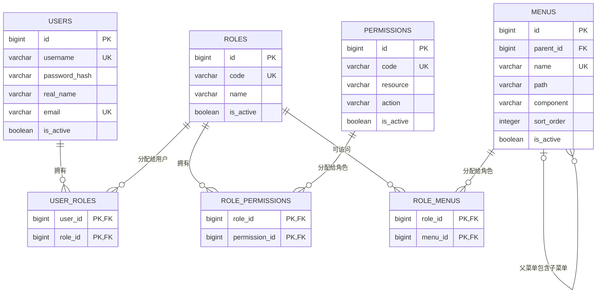
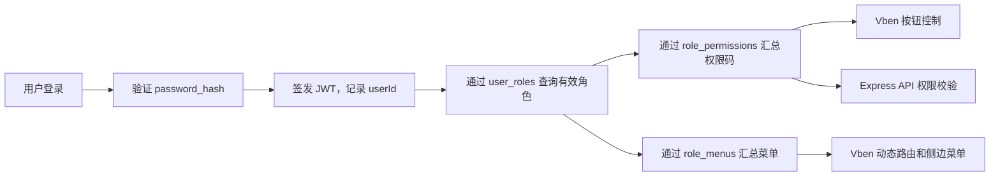
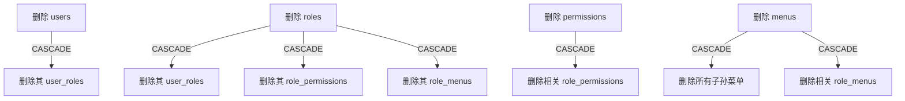

# RBAC 数据库设计说明

本文档说明 `database` 目录下 PostgreSQL 初始化脚本、数据表字段、表关系、约束、种子数据，以及这些数据如何服务于 Express 后端和 Vben Admin 前端。

## 1. 文件说明

| 文件                     | 作用                                             | 执行位置                              | 是否可重复执行                 |
| ------------------------ | ------------------------------------------------ | ------------------------------------- | ------------------------------ |
| `00-create-database.sql` | 创建名为`rbac` 的数据库                          | 连接`postgres` 等已有管理数据库后执行 | 否；数据库已存在时会报错       |
| `01-schema.sql`          | 创建表、索引、触发器，并写入基础角色、权限和菜单 | 连接新建的`rbac` 数据库后执行         | 否；表或种子数据已存在时会报错 |

这两份文件定位为“全新环境的一次性初始化脚本”，不是增量迁移文件。项目后续发生结构变更时，建议引入专门的迁移工具并创建按时间排序的迁移文件，不要直接在生产数据库反复运行初始化脚本。

## 2. 执行方法

在项目根目录执行：

```bash
psql -U postgres -h localhost -f database/00-create-database.sql
psql -U postgres -h localhost -d rbac -f database/01-schema.sql
```

如果 `rbac` 数据库已经存在，只执行第二条命令。执行前应确认 `.env` 中的数据库名称与脚本一致：

```env
DATABASE_URL=postgresql://postgres:密码@localhost:5432/rbac
```

### 2.1 为什么创建数据库脚本没有 `IF NOT EXISTS`

PostgreSQL 的 `CREATE DATABASE` 不支持 `IF NOT EXISTS`，并且不能在事务块或 `DO` 块中执行。当前脚本选择在数据库已存在时明确失败，避免误以为创建了一个全新的数据库。

### 2.2 事务边界

`01-schema.sql` 使用 `BEGIN` 和 `COMMIT` 包裹。中间任何建表或种子数据语句失败时，整个事务都会回滚，避免只创建一部分对象。

`00-create-database.sql` 不能这样处理，因为 PostgreSQL 不允许在事务块中执行 `CREATE DATABASE`。

## 3. RBAC 模型概览

RBAC 是 Role-Based Access Control，即基于角色的访问控制：

1. 用户不直接绑定大量权限，而是先绑定角色。
2. 角色绑定权限码，决定用户能执行什么操作。
3. 角色绑定菜单，决定 Vben Admin 向用户展示哪些页面入口。
4. 一个用户可以有多个角色，最终权限和菜单取所有有效角色的并集。

本设计把“能否看到菜单”和“能否调用接口”分开。隐藏前端按钮或菜单不能代替后端鉴权；Express 仍需在敏感接口上验证权限码。

## 4. ER 关系图



简化的数据流如下：



## 5. 表关系说明

### 5.1 用户与角色

`users` 和 `roles` 是多对多关系，由 `user_roles` 连接：

- 一个用户可以同时是管理员和审计员。
- 一个角色可以分配给多个用户。
- `(user_id, role_id)` 联合主键防止重复分配同一角色。

### 5.2 角色与权限

`roles` 和 `permissions` 是多对多关系，由 `role_permissions` 连接：

- 一个角色可以拥有多个权限码。
- 一个权限码可以授权给多个角色。
- 用户最终权限是其所有有效角色所拥有权限的去重并集。

### 5.3 角色与菜单

`roles` 和 `menus` 是多对多关系，由 `role_menus` 连接：

- 一个角色可以访问多个菜单。
- 同一个菜单可以开放给多个角色。
- 后端通过此关系生成符合 Vben Admin 格式的动态菜单树。

### 5.4 菜单自关联

`menus.parent_id` 指向 `menus.id`：

- `parent_id IS NULL` 表示根菜单。
- `parent_id` 有值表示当前菜单是另一个菜单的子节点。
- 删除父菜单时，数据库通过 `ON DELETE CASCADE` 自动删除全部直接和间接子菜单。

## 6. 字段字典

### 6.1 `users`：用户表

保存登录主体和用户基础资料。角色、权限不直接放在此表中。

| 字段            | 类型              | 可空 | 默认值   | 说明                                                             |
| --------------- | ----------------- | ---- | -------- | ---------------------------------------------------------------- |
| `id`            | `BIGINT IDENTITY` | 否   | 自动生成 | 用户主键。使用 64 位整数，适合长期增长；应用插入时不要手动赋值。 |
| `username`      | `VARCHAR(50)`     | 否   | 无       | 登录名。通过`lower(username)` 唯一索引实现不区分大小写的唯一性。 |
| `password_hash` | `VARCHAR(255)`    | 否   | 无       | 密码哈希，只能保存 bcrypt 等算法的结果，绝不能保存明文密码。     |
| `real_name`     | `VARCHAR(100)`    | 否   | 无       | 用户显示名称，可映射为 Vben 用户信息中的`realName`。             |
| `avatar`        | `VARCHAR(500)`    | 是   | `NULL`   | 头像 URL 或相对资源地址。                                        |
| `email`         | `VARCHAR(255)`    | 是   | `NULL`   | 邮箱。非空时通过部分唯一索引保证不区分大小写且不可重复。         |
| `is_active`     | `BOOLEAN`         | 否   | `TRUE`   | 账号状态。`FALSE` 表示禁用，登录和鉴权时都应拒绝该用户。         |
| `last_login_at` | `TIMESTAMPTZ`     | 是   | `NULL`   | 最近一次成功登录时间。认证成功后由应用更新。                     |
| `created_at`    | `TIMESTAMPTZ`     | 否   | 当前时间 | 创建时间，包含时区语义。                                         |
| `updated_at`    | `TIMESTAMPTZ`     | 否   | 当前时间 | 修改时间，由触发器自动刷新。                                     |

额外约束：

- `users_username_not_blank`：禁止只由空格组成的用户名。
- `users_real_name_not_blank`：禁止只由空格组成的显示名称。
- `users_username_lower_uq`：`Admin` 与 `admin` 被视为同一个用户名。
- `users_email_lower_uq`：只约束非空邮箱，因此允许多个用户不填写邮箱。

### 6.2 `roles`：角色表

角色是用户与权限、菜单之间的授权集合。

| 字段          | 类型              | 可空 | 默认值   | 说明                                                                   |
| ------------- | ----------------- | ---- | -------- | ---------------------------------------------------------------------- |
| `id`          | `BIGINT IDENTITY` | 否   | 自动生成 | 角色主键。                                                             |
| `code`        | `VARCHAR(50)`     | 否   | 无       | 稳定的程序标识，如`super_admin`。需要返回给 Vben 的 `userInfo.roles`。 |
| `name`        | `VARCHAR(100)`    | 否   | 无       | 面向管理员展示的角色名称，如“超级管理员”。                             |
| `description` | `VARCHAR(500)`    | 是   | `NULL`   | 角色用途说明。                                                         |
| `is_active`   | `BOOLEAN`         | 否   | `TRUE`   | 角色是否有效。查询用户授权时必须过滤无效角色。                         |
| `created_at`  | `TIMESTAMPTZ`     | 否   | 当前时间 | 创建时间。                                                             |
| `updated_at`  | `TIMESTAMPTZ`     | 否   | 当前时间 | 修改时间，由触发器维护。                                               |

`code` 使用普通唯一约束，因此建议在应用层统一保存为小写蛇形命名，避免同时出现 `Admin` 和 `admin`。

### 6.3 `permissions`：权限表

权限表示一个可以被独立授权的操作，同时用于 Vben 按钮控制与 Express 服务端鉴权。

| 字段          | 类型              | 可空 | 默认值   | 说明                                                           |
| ------------- | ----------------- | ---- | -------- | -------------------------------------------------------------- |
| `id`          | `BIGINT IDENTITY` | 否   | 自动生成 | 权限主键。                                                     |
| `code`        | `VARCHAR(100)`    | 否   | 无       | 权限码，如`user:create`。Vben 的 access codes 接口返回此字段。 |
| `name`        | `VARCHAR(100)`    | 否   | 无       | 权限中文名称，如“新增用户”。                                   |
| `resource`    | `VARCHAR(50)`     | 否   | 无       | 被操作资源，如`user`、`role`、`menu`。                         |
| `action`      | `VARCHAR(50)`     | 否   | 无       | 操作类型，如`list`、`create`、`update`、`delete`。             |
| `description` | `VARCHAR(500)`    | 是   | `NULL`   | 权限用途或业务范围说明。                                       |
| `is_active`   | `BOOLEAN`         | 否   | `TRUE`   | 权限是否有效。鉴权查询时必须过滤无效权限。                     |
| `created_at`  | `TIMESTAMPTZ`     | 否   | 当前时间 | 创建时间。                                                     |
| `updated_at`  | `TIMESTAMPTZ`     | 否   | 当前时间 | 修改时间，由触发器维护。                                       |

约定 `code = resource || ':' || action`。数据库当前分别保证 `code` 唯一和 `(resource, action)` 唯一，但没有自动验证两者文本必须拼接一致，因此新增权限时应由服务层统一生成 `code`。

### 6.4 `menus`：动态菜单表

保存 Vben Admin 动态路由需要的服务端菜单数据。后端读取平面数据后，应按 `parent_id` 组装为树。

| 字段         | 类型              | 可空 | 默认值   | Vben 映射与说明                                                                                       |
| ------------ | ----------------- | ---- | -------- | ----------------------------------------------------------------------------------------------------- |
| `id`         | `BIGINT IDENTITY` | 否   | 自动生成 | 菜单主键，只用于数据库关系，一般不需要作为 Vben 路由字段。                                            |
| `parent_id`  | `BIGINT`          | 是   | `NULL`   | 父菜单 ID。为空表示根菜单；映射时用它生成`children`。                                                 |
| `name`       | `VARCHAR(100)`    | 否   | 无       | 路由名称，对应 Vben 路由的`name`，全表唯一。                                                          |
| `path`       | `VARCHAR(255)`    | 否   | 无       | 路由 URL，对应 Vben 路由的`path`。                                                                    |
| `component`  | `VARCHAR(255)`    | 是   | `NULL`   | 页面组件路径，如`/system/user/index`；目录菜单通常为空。路径需与前端 `views` 文件对应。               |
| `redirect`   | `VARCHAR(255)`    | 是   | `NULL`   | 默认跳转地址，如`/system` 跳到 `/system/user`。                                                       |
| `title`      | `VARCHAR(100)`    | 否   | 无       | 菜单标题，对应`meta.title`；也可以保存国际化 key。                                                    |
| `icon`       | `VARCHAR(100)`    | 是   | `NULL`   | 菜单图标，对应`meta.icon`，如 `lucide:settings`。                                                     |
| `sort_order` | `INTEGER`         | 否   | `0`      | 同级菜单排序值，建议升序返回。对应`meta.order` 的语义。                                               |
| `is_hidden`  | `BOOLEAN`         | 否   | `FALSE`  | 是否隐藏菜单入口。路由仍可存在，后端映射到 Vben 相应 meta 配置。                                      |
| `keep_alive` | `BOOLEAN`         | 否   | `FALSE`  | 是否缓存页面组件，可映射到 Vben 的`meta.keepAlive`。                                                  |
| `is_active`  | `BOOLEAN`         | 否   | `TRUE`   | 菜单是否启用。禁用菜单及其不可达子菜单不应返回前端。                                                  |
| `extra_meta` | `JSONB`           | 否   | `{}`     | 保存未独立建列的 Vben`meta` 扩展配置，例如 `badge`、`link` 等。固定且常查询的属性应优先建成普通字段。 |
| `created_at` | `TIMESTAMPTZ`     | 否   | 当前时间 | 创建时间。                                                                                            |
| `updated_at` | `TIMESTAMPTZ`     | 否   | 当前时间 | 修改时间，由触发器维护。                                                                              |

重要行为：

- `parent_id` 使用 `ON DELETE CASCADE`，删除目录会连带删除其子孙菜单及相关 `role_menus` 记录。
- `(parent_id, path)` 防止同一个父菜单下出现重复路径。
- `menus_parent_sort_idx` 优化按父节点读取和排序菜单树的查询。
- `menus_extra_meta_gin_idx` 优化针对 `extra_meta` JSONB 包含关系的查询。
- 因为 PostgreSQL 唯一约束默认允许多个 `NULL`，根菜单的 `(parent_id, path)` 唯一性主要还需依赖全局唯一的 `name`，或由应用层检查根路径。

### 6.5 `user_roles`：用户角色关联表

| 字段         | 类型          | 可空 | 说明                                         |
| ------------ | ------------- | ---- | -------------------------------------------- |
| `user_id`    | `BIGINT`      | 否   | 指向`users.id`。删除用户时关联记录自动删除。 |
| `role_id`    | `BIGINT`      | 否   | 指向`roles.id`。删除角色时关联记录自动删除。 |
| `created_at` | `TIMESTAMPTZ` | 否   | 角色分配时间，可用于审计。                   |

联合主键 `(user_id, role_id)` 同时承担唯一约束。`user_roles_role_id_idx` 用于从角色反查其全部用户。

### 6.6 `role_permissions`：角色权限关联表

| 字段            | 类型          | 可空 | 说明                   |
| --------------- | ------------- | ---- | ---------------------- |
| `role_id`       | `BIGINT`      | 否   | 指向`roles.id`。       |
| `permission_id` | `BIGINT`      | 否   | 指向`permissions.id`。 |
| `created_at`    | `TIMESTAMPTZ` | 否   | 权限授予时间。         |

联合主键 `(role_id, permission_id)` 防止重复授权。两端外键都使用级联删除。`role_permissions_permission_id_idx` 用于从权限反查拥有该权限的角色。

### 6.7 `role_menus`：角色菜单关联表

| 字段         | 类型          | 可空 | 说明             |
| ------------ | ------------- | ---- | ---------------- |
| `role_id`    | `BIGINT`      | 否   | 指向`roles.id`。 |
| `menu_id`    | `BIGINT`      | 否   | 指向`menus.id`。 |
| `created_at` | `TIMESTAMPTZ` | 否   | 菜单授权时间。   |

联合主键 `(role_id, menu_id)` 防止重复分配。`role_menus_menu_id_idx` 用于从菜单反查可访问该菜单的角色。

给角色分配子菜单时，也应分配其祖先目录，否则构建树时子菜单没有可展示的父节点。服务层可以在保存授权时自动补齐祖先菜单。

## 7. 外键删除行为



级联删除只清理关联数据，不会因为删除角色而删除用户，也不会因为删除权限而删除角色。

生产系统通常更倾向于把用户、角色、权限设为 `is_active = FALSE`，保留审计历史；物理删除应限制为无历史依赖的数据。

## 8. 索引设计

PostgreSQL 会自动为主键和唯一约束创建索引，但不会自动为所有外键创建反向查询索引，因此脚本显式增加了关联表另一方向的索引。

| 索引                                 | 作用                                                           |
| ------------------------------------ | -------------------------------------------------------------- |
| `users_username_lower_uq`            | 登录时用`lower(username)` 查询，并保证用户名不区分大小写唯一。 |
| `users_email_lower_uq`               | 保证非空邮箱不区分大小写唯一。                                 |
| `menus_parent_sort_idx`              | 按父菜单查找并按顺序构建菜单树。                               |
| `menus_extra_meta_gin_idx`           | 支持 JSONB 包含查询。                                          |
| `user_roles_role_id_idx`             | 由角色反查用户。                                               |
| `role_permissions_permission_id_idx` | 由权限反查角色。                                               |
| `role_menus_menu_id_idx`             | 由菜单反查角色。                                               |

## 9. `updated_at` 触发器

`set_updated_at()` 是通用触发器函数。对以下表执行任意 `UPDATE` 前，数据库都会把新记录的 `updated_at` 设置为当前时间：

- `users`
- `roles`
- `permissions`
- `menus`

关联表没有 `updated_at`，因为授权关系只有“存在”和“不存在”两种状态。修改授权通常表现为删除旧关系并插入新关系。

## 10. 初始化种子数据

### 10.1 角色

| code          | 名称       | 默认能力                                                                 |
| ------------- | ---------- | ------------------------------------------------------------------------ |
| `super_admin` | 超级管理员 | 当前拥有全部权限和全部菜单。后续新增权限时，应用或迁移仍需为其补充分配。 |
| `admin`       | 管理员     | 当前示例中与超级管理员相同，后续可按业务缩小范围。                       |
| `viewer`      | 只读用户   | 只拥有`action = 'list'` 的权限，并只能看到系统目录和用户管理菜单。       |

### 10.2 权限码

初始权限覆盖：

- 用户：`user:list/create/update/delete`
- 角色：`role:list/create/update/delete`
- 权限：`permission:list`
- 菜单：`menu:list/create/update/delete`

权限码建议始终使用小写的 `资源:动作` 格式。

### 10.3 菜单

初始树结构：

```text
系统管理 /system
├── 用户管理 /system/user
├── 角色管理 /system/role
└── 菜单管理 /system/menu
```

SQL 不创建默认用户。用户必须通过应用层使用 bcrypt 生成 `password_hash`，然后再写入 `users` 和 `user_roles`。这样可以避免初始化文件包含明文密码或固定密码哈希。

## 11. Vben Admin 数据映射

### 11.1 用户信息

查询 `users -> user_roles -> roles` 后可以返回：

```json
{
  "id": 1,
  "username": "admin",
  "realName": "管理员",
  "avatar": null,
  "roles": ["super_admin"]
}
```

### 11.2 权限码

查询用户全部有效角色所关联的有效权限，去重后返回字符串数组：

```json
["user:list", "user:create", "user:update", "user:delete"]
```

Vben 用此数组控制按钮显示；Express 使用相同权限码进行真正的 API 授权。

### 11.3 动态菜单

数据库中的一条子菜单应映射为：

```json
{
  "name": "UserManagement",
  "path": "/system/user",
  "component": "/system/user/index",
  "meta": {
    "title": "用户管理",
    "icon": "lucide:users",
    "order": 10,
    "keepAlive": false
  }
}
```

后端应只查询有效用户、有效角色和有效菜单，并将平面菜单按 `parent_id` 组装为 `children` 树。

## 12. 常用查询示例

以下 SQL 用于说明关系。Express 中应使用 `$1` 参数传入用户 ID，不要拼接客户端输入。

### 12.1 查询用户角色

```sql
SELECT DISTINCT r.code, r.name
FROM user_roles ur
JOIN roles r ON r.id = ur.role_id
JOIN users u ON u.id = ur.user_id
WHERE ur.user_id = $1
  AND u.is_active = TRUE
  AND r.is_active = TRUE
ORDER BY r.code;
```

### 12.2 查询用户权限码

```sql
SELECT DISTINCT p.code
FROM user_roles ur
JOIN roles r ON r.id = ur.role_id AND r.is_active = TRUE
JOIN role_permissions rp ON rp.role_id = r.id
JOIN permissions p ON p.id = rp.permission_id AND p.is_active = TRUE
JOIN users u ON u.id = ur.user_id AND u.is_active = TRUE
WHERE ur.user_id = $1
ORDER BY p.code;
```

### 12.3 在后端验证单个权限

```sql
SELECT EXISTS (
  SELECT 1
  FROM users u
  JOIN user_roles ur ON ur.user_id = u.id
  JOIN roles r ON r.id = ur.role_id AND r.is_active = TRUE
  JOIN role_permissions rp ON rp.role_id = r.id
  JOIN permissions p ON p.id = rp.permission_id AND p.is_active = TRUE
  WHERE u.id = $1
    AND u.is_active = TRUE
    AND p.code = $2
) AS allowed;
```

例如 `$1 = 当前 JWT 中的 userId`，`$2 = 'user:delete'`。结果为 `FALSE` 时应返回 HTTP `403`。

### 12.4 查询用户可访问菜单

```sql
SELECT DISTINCT
  m.id,
  m.parent_id,
  m.name,
  m.path,
  m.component,
  m.redirect,
  m.title,
  m.icon,
  m.sort_order,
  m.is_hidden,
  m.keep_alive,
  m.extra_meta
FROM user_roles ur
JOIN roles r ON r.id = ur.role_id AND r.is_active = TRUE
JOIN role_menus rm ON rm.role_id = r.id
JOIN menus m ON m.id = rm.menu_id AND m.is_active = TRUE
JOIN users u ON u.id = ur.user_id AND u.is_active = TRUE
WHERE ur.user_id = $1
ORDER BY m.sort_order, m.id;
```

### 12.5 给用户分配角色

```sql
INSERT INTO user_roles (user_id, role_id)
VALUES ($1, $2)
ON CONFLICT (user_id, role_id) DO NOTHING;
```

### 12.6 完整替换角色权限

应在同一个事务内执行，避免更新过程中出现短暂的半成品状态：

```sql
BEGIN;

DELETE FROM role_permissions
WHERE role_id = $1;

INSERT INTO role_permissions (role_id, permission_id)
SELECT $1, id
FROM permissions
WHERE id = ANY($2::bigint[])
  AND is_active = TRUE;

COMMIT;
```

## 13. 应用层必须遵守的规则

1. 密码只保存 bcrypt 哈希；日志、响应和错误信息中不得出现密码或 `DATABASE_URL`。
2. 登录时同时检查 `users.is_active`。
3. 获取角色时过滤 `roles.is_active`。
4. 获取权限时过滤 `permissions.is_active`。
5. 获取菜单时过滤 `menus.is_active`，并处理父节点不可用的情况。
6. 后端接口必须独立鉴权，不能只依赖 Vben 隐藏菜单或按钮。
7. 所有客户端输入都使用 `pg` 参数化查询。
8. 修改角色权限、角色菜单或用户角色时使用事务。
9. JWT 中建议只保存稳定标识（例如 `userId`），不要长期缓存完整权限列表；权限变更后才能及时生效。
10. 涉及授权变更时应记录操作者、目标对象和时间。当前 Demo 表结构没有审计日志表，可在后续迭代增加。

## 14. 当前设计边界和可扩展项

这是适合小型 RBAC Demo 的基础模型。真实生产项目可能还需要：

- `refresh_tokens`：刷新令牌轮换、撤销和会话管理。
- `audit_logs`：登录、用户变更、角色授权等审计日志。
- `departments` / `user_departments`：组织架构。
- 数据权限：只能查看本人、本部门或指定范围的数据。
- 角色继承：高级角色继承基础角色权限。
- 菜单与权限关联：访问某个页面必须同时具备指定权限。
- 乐观锁或版本字段：防止多人同时编辑角色授权时互相覆盖。
- 软删除字段：保留历史数据并支持恢复。
- 数据库迁移体系：记录每次结构变更并支持多环境升级。

对于当前 Demo，建议先完成“用户登录 → JWT → 用户角色 → 权限码 → 动态菜单 → 后端接口鉴权”的闭环，再逐步增加上述能力。
